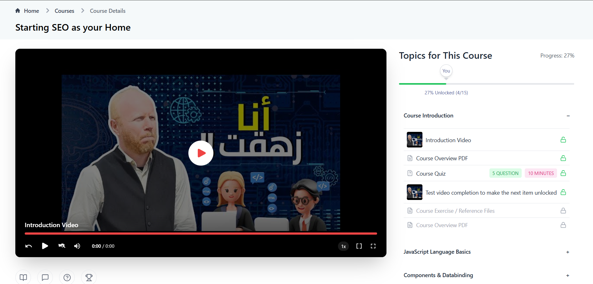

<div align="center">
  <h1>IT Legend Learning Platform</h1>
  <h3>A modern web-based learning platform built with React, TypeScript, and Vite.</h3>
  <p>Featuring video courses, interactive quizzes, and a student leaderboard system.</p>

  [Live Demo](https://it-legend-task.vercel.app/) | [Report Bug](https://github.com/nourmohamed45/new-it-legend-task-main/issues) | [Request Feature](https://github.com/nourmohamed45/new-it-legend-task-main/issues)
</div>





## 📋 Table of Contents
- [Overview](#overview)
- [Key Features](#-key-features)
- [Tech Stack](#-tech-stack)
- [Getting Started](#-getting-started)
- [Project Structure](#-project-structure)
- [Features in Detail](#-features-in-detail)
- [Contributing](#-contributing)
- [Author](#-author)
- [License](#-license)

## Overview

IT Legend Learning Platform is a comprehensive e-learning solution that provides an interactive and engaging learning experience. The platform features a custom-built video player, interactive quizzes, a leaderboard system, and a robust course discussion system.

## 🚀 Key Features

- **Advanced Video Player**
  - Custom controls with keyboard shortcuts
  - Playback speed control (0.25x to 2x)
  - Progress bar with time preview
  - Full-screen and wide-screen modes
  - Volume control with mute option

- **Interactive Learning**
  - 📝 Dynamic quizzes and assessments
  - 🏆 Real-time leaderboard system
  - 💬 Course discussions and comments
  - 📊 Progress tracking
  - 📑 Intuitive course navigation

- **User Experience**
  - 📱 Responsive design for all devices
  - 🎨 Modern UI with Tailwind CSS
  - ⚡ Fast loading with Vite
  - 🔍 Easy course content discovery

## 🛠️ Tech Stack

- **Frontend Framework**
  - React 19
  - TypeScript
  - Vite

- **Styling**
  - TailwindCSS
  - SASS

- **Dependencies**
  - React Router v7
  - Lucide React Icons

- **Development Tools**
  - ESLint
  - PostCSS
  - TypeScript ESLint

## 🚦 Getting Started

1. **Clone the repository**
   ```bash
   git clone https://github.com/nourmohamed45/new-it-legend-task.git
   ```

2. **Navigate to project directory**
   ```bash
   cd new-it-legend-task
   ```

3. **Install dependencies**
   ```bash
   npm install
   ```

4. **Start development server**
   ```bash
   npm run dev
   ```

5. **Build for production**
   ```bash
   npm run build
   ```

6. **Lint code**
   ```bash
   npm run lint
   ```

## 📁 Project Structure

```
src/
├── components/
│   ├── VideoPlayer/       # Custom video player components
│   ├── course/           # Course-related components
│   ├── topics/           # Topic navigation components
│   └── ...               # Other shared components
├── utils/                # Utility functions
├── data/                # Static data and configurations
├── App.tsx              # Main application component
└── main.tsx            # Application entry point
```

## 🎯 Features in Detail

### Video Player
- Custom-built video controls
- Time-based navigation
- Thumbnail preview on progress bar hover
- Multiple playback speeds

### Course System
- Organized topic structure
- Progress tracking
- Reference materials
- Course completion tracking

### Interactive Features
- Real-time leaderboard updates
- Interactive quizzes
- Course discussions
- Comment system

### User Interface
- Responsive design
- Mobile-first approach
- Accessible components
- Modern animations and transitions

## 🤝 Contributing

We welcome contributions to improve the IT Legend Learning Platform! Here's how you can contribute:

1. Fork the Project
2. Create your Feature Branch (`git checkout -b feature/AmazingFeature`)
3. Commit your Changes (`git commit -m 'Add some AmazingFeature'`)
4. Push to the Branch (`git push origin feature/AmazingFeature`)
5. Open a Pull Request

## ✨ Author

**Nour Mohamed**
- 📧 Email: nour.mohamed.mohamed@gmail.com
- 🌐 GitHub: [@nourmohamed45](https://github.com/nourmohamed45)
- 💼 LinkedIn: [Nour Mohamed](https://www.linkedin.com/in/nour-mohamed-204549268/)

## 📄 License

This project is licensed under the MIT License - see the [LICENSE](LICENSE) file for details.

---

<div align="center">
  <p>Don't forget to give the project a star! Thanks for visiting! 🌟</p>
  
  [](https://github.com/nourmohamed45/new-it-legend-task-main/stargazers)
  [](https://github.com/nourmohamed45/new-it-legend-task-main/network)
  [](https://github.com/nourmohamed45/new-it-legend-task-main/issues)
</div>
